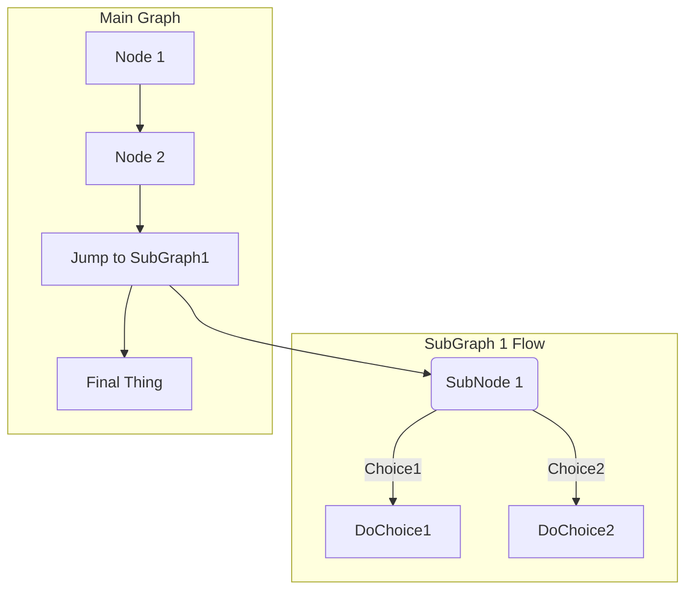

# Dialog Designer

[[_TOC_]]

Single Page Drag/Drop application to create AEM Dialogs.

## Supported fields

### Layout

- tabs (section)
- fieldset

### Normal Fields

- textfield
- textarea
- numberfield
- richtext
- datepicker
- hidden

### Selection Fields

- select
- checkbox
- switch
- buttongroup
- radio

### Resource Fields

- fileupload
- pathfield

### Authoring Helpers

- anchorbutton
- alert
- heading

### Custom Fields

sample


## Adding Custom Field

...

```javascript
/* eslint-disable no-undef */
import constants from '../../constants';

const helloworld = {
  name: 'HelloWorld',
  tag: 'HW',
  category: constants.fieldCategories.CUSTOM.name,
  tagColor: constants.fieldCategories.CUSTOM.color,
  description: 'Hello World Sample',
  id: 'helloworld',
  fields: [
    FIELD_DEFINITION_ID,
    {
      id: 'hello',
      label: 'Hellotext',
      description: '',
      type: 'String',
      defaultValue: 'Hello',
      required: true,
    },
    {
      id: 'world',
      label: 'Worldtext',
      description: '',
      type: 'String',
      defaultValue: 'World',
      required: true,
    },
  ],
  previewOutput: `<div class="helloworld">
   <span class="helloworld_hello">{hello}</span>
   <span class="helloworld_world">{world}</span>
  </div>`,
  xmlOutput: `<{id}
    jcr:primaryType="nt:unstructured"
    sling:resourceType="/apps/components/dialogfields/helloworld"
    hello="{hello}"
    world="{world}"
  />`,
};

export default helloworld;
```

### Field edit Definitions

default Field definitions to use in fields []

- FIELD_DEFINITION_ID
- FIELD_DEFINITION_LABEL
- FIELD_DEFINITION_REQUIRED
- FIELD_DEFINITION_DESCRIPTION

Example:
```javascript
{
  id: 'hello',
  label: 'Hellotext',
  description: '',
  type: 'String',
  defaultValue: 'Hello',
  required: true,
},
```

## Test


